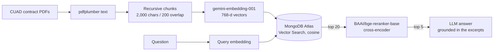
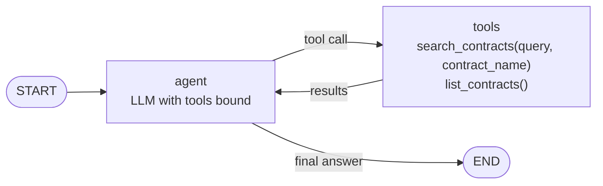

# Legal Contract RAG: retrieval study + LangGraph agent

Question answering over 48 commercial contracts from the CUAD dataset, with the retrieval design chosen by a measured study and a LangGraph agent that scopes its search to the contract you mean.

Built as an internship project in 2026.

## What it does

- **Answers questions about legal contracts.** Answers are grounded in retrieved excerpts and name the contract they came from.
- **v1, the retrieval pipeline:** dense retrieval plus cross-encoder reranking. It was chosen by a retrieval study that compared dense, BM25, hybrid, HyDE and multi-query retrieval on 189 questions, using deterministic scoring and bootstrap confidence intervals.
- **v2, the agent:** a LangGraph ReAct agent with two tools. It works out which contract a question is about, scopes the search to that contract, compares clauses across contracts, and keeps conversation memory per thread.
- **Streamlit app:** a chat UI that shows the agent's tool calls, lists the indexed contracts and lets you upload a new contract into the live index. You pick the LLM provider (Ollama, AWS Bedrock or Gemini) when you launch it.
- **Evaluation:** deterministic retrieval metrics, RAGAS runs at milestones, v2 recovery and regression suites graded by a separate local judge, and LangSmith tracing hooks.

## Architecture

### Retrieval pipeline (v1)



- **Ingestion:** 48 contracts (~848 pages) become 1,402 chunks. Embedding runs in batches and is checkpointed per document, so a run that hits API quota errors can resume where it stopped (`eval/ingest_corpus50.py`).
- **Retrieval:** embed the question, take the top 20 chunks from Atlas Vector Search, rerank them with the `BAAI/bge-reranker-base` cross-encoder and keep the top 5 (`app/pipeline.py`).
- **Generation:** a strict prompt answers only from the excerpts, and replies "Not found in the provided documents." when they don't contain the answer. The v1 chat chain (`app/chat.py`, `app/router.py`) rewrites follow-up questions into standalone ones and routes each turn either to retrieval or to a direct reply.

### Agent (v2)



- **ReAct loop** (`app/agent.py`): the agent node and a LangGraph `ToolNode` alternate until the model can answer. A `MemorySaver` checkpointer keyed by `thread_id` gives each conversation its own memory.
- **`search_contracts(query, contract_name)`** (`app/tools.py`): vector search plus reranking, optionally scoped to one contract. Scoping matters because near-identical boilerplate (governing law, assignment, liability caps) appears in every contract. The contract name is resolved by title first. If no title matches, the tool searches contract text for the name and scopes to the contract that owns most of the top-ranked chunks, or asks the user to choose when several contracts compete.
- **`list_contracts()`:** lists every indexed contract title. The agent uses it for sweeps ("which contracts...") and for disambiguation.
- **Comparisons:** the agent runs one scoped search per contract and then combines the results.
- **Models:** the generator is set by config: Ollama (local), an LLM on AWS Bedrock (model set via env/config), or Gemini (`app/llm.py`). Embeddings always use Gemini because they must match the index.

### Repository layout

| Path | Contents |
|---|---|
| `app/` | config, retrieval pipeline, LLM provider switch, v1 chat chain, v2 agent and tools, live upload ingestion |
| `streamlit_app.py`, `pages/` | Streamlit chat UI and the "Under the hood" page |
| `rag_lib.py` | shared library for the study scripts (clients, chunkers, retrievers, deterministic scorer) |
| `eval/` | evaluation scripts, question sets and run logs (see `eval/README.md`) |
| `results/` | result JSONs: per-question ranks, score ledgers, RAGAS judgments, v2 suite outputs |
| `data/corpus50_manifest.json` | the CUAD PDFs that make up the corpus |
| `OPTIMIZATION_STUDY.md` | full write-up of the retrieval study |

## Results

### Retrieval study

The study scored 189 questions by matching each question's gold passage deterministically, with no LLM in the scoring loop. It reports 95% confidence intervals from a 10,000-resample bootstrap. Scoring is LLM-free because a small LLM judge (RAGAS) once inverted a conclusion that the deterministic metric got right.

| Configuration | recall@5 | MRR | Outcome |
|---|---|---|---|
| **Dense + rerank** | **0.815** [0.757, 0.868] | **0.691** | **Shipped** |
| Dense only | 0.799 | 0.638 | Baseline without reranking |
| Hybrid (dense + BM25) + rerank | 0.810 | 0.682 | Tie |
| HyDE + rerank | 0.820 | 0.699 | Tie, +1.4 s latency |
| Multi-query + rerank | 0.815 | 0.690 | Tie, ~2.4× latency |
| BM25 + rerank | 0.619 | 0.530 | Worse |
| BM25 alone | 0.487 | 0.382 | Worse |

The simplest configuration within the confidence interval was shipped.

- **Scale changed the picture.** Going from 11 to 48 contracts dropped recall@5 from 0.949 to 0.815.
- **Failure analysis of the 35 misses:**
  - 24 were caused by reranking: the gold passage was in the top 20 candidates but was reranked out of the top 5.
  - 11 were caused by retrieval: the gold passage never reached the top 20.
  - Misses concentrate in look-alike clause types, such as liability caps (recall@5 0.429).
- **Latency and cost (v1):**
  - About 2.4 s per query: 0.93 s of retrieval (median of 6 queries) plus 1.44 s of generation (median of 3 short generation calls).
  - About $0.80 per 1,000 queries, computed from measured token counts × list prices.

The full write-up is in [`OPTIMIZATION_STUDY.md`](OPTIMIZATION_STUDY.md).

### Agent (v2)

- **Scoped search:** contract-scoped search fixed 23 of the 35 baseline misses. This was measured before the later name-resolution fix.
- **Regression suite:** a 162-question suite, graded by a separate local Gemma model via Ollama, caught 42 regressions (26%). They were caused by contract-name resolution.
- **Fix:** a change to name resolution recovered 21 of the 42, halving the regressions.
- **Not yet re-measured:** the final resolver version has not been re-evaluated end to end.

## How to run

**Prerequisites:**

- Python 3.12 and [uv](https://docs.astral.sh/uv/)
- A MongoDB Atlas cluster with Vector Search
- A Gemini API key (embeddings always use Gemini)
- At least one generator: Ollama running locally, AWS Bedrock access, or Gemini
- Optional: a LangSmith account for tracing

Run every command from the repository root.

### 1. Install

```bash
uv sync
```

### 2. Configure

Create a `.env` file in the repository root. It is git-ignored. These are the variables the code reads:

```dotenv
# Required
GEMINI_API_KEY=                  # Gemini embeddings (always) and optional Gemini generation/judging
MONGO_URI=                       # MongoDB Atlas connection string

# Generator and judge selection: ollama | bedrock | gemini
LLM_PROVIDER=                    # generator for scripts and the agent
JUDGE_PROVIDER=                  # grader for the v2 eval suites, kept separate from the generator

# Optional model and runtime overrides
GEN_MODEL=                       # Gemini generation model
LOCAL_MODEL=                     # Ollama model tag
OLLAMA_BASE=                     # Ollama server URL
BEDROCK_MODEL=                   # Bedrock model ID
BEDROCK_REGION=
BEDROCK_AWS_ACCESS_KEY_ID=       # if unset, the default AWS credential chain is used
BEDROCK_AWS_SECRET_ACCESS_KEY=
RERANKER_DEVICE=                 # cpu (default) or cuda

# Optional: LangSmith tracing
LANGCHAIN_TRACING_V2=
LANGCHAIN_API_KEY=
LANGCHAIN_ENDPOINT=
LANGCHAIN_PROJECT=

# Only for the original S3-based ingestion path in rag_lib.py
S3_BUCKET=
AWS_ACCESS_KEY_ID=
AWS_SECRET_ACCESS_KEY=
AWS_REGION=
```

The Streamlit app picks its generator from `UI_PROVIDER`, which you set on the command line (see step 5) rather than in `.env`.

### 3. Get the corpus

Follow the steps under [Data](#data) to download CUAD and build `data/corpus50/`.

### 4. Ingest and index

```bash
PYTHONPATH=. .venv/bin/python eval/ingest_corpus50.py      # parse, chunk, embed, insert (resumable)
PYTHONPATH=. .venv/bin/python eval/create_vector_index.py  # Atlas Vector Search index + filter fields
```

The BM25 and hybrid configurations in the study also need an Atlas Search index named `chunks_text_index` on the `rag.chunks` collection.

### 5. Run the app

```bash
UI_PROVIDER=gemini PYTHONPATH=. .venv/bin/streamlit run streamlit_app.py   # ollama | bedrock | gemini
```

The app opens at http://localhost:8501.

### 6. Run the evaluations

The retrieval study scripts are listed in order in [`eval/README.md`](eval/README.md), along with their extra prerequisites (for example the local Ollama models used for the RAGAS runs). Start with:

```bash
PYTHONPATH=. .venv/bin/python eval/sweep_v10.py     # deterministic sweep, per-question ranks
PYTHONPATH=. .venv/bin/python eval/analyze_v10.py   # bootstrap CIs, paired tests, miss diagnosis
```

The v2 agent suites:

```bash
# Replay the 35 baseline misses through the agent
LLM_PROVIDER=bedrock JUDGE_PROVIDER=ollama PYTHONPATH=. .venv/bin/python eval/scoped_recovery.py
# 162-question regression suite (IDS=id1,id2,... re-runs a subset)
LLM_PROVIDER=bedrock JUDGE_PROVIDER=ollama PYTHONPATH=. .venv/bin/python eval/regression_check.py
# Compare the local judge with a Gemini judge on N saved verdicts
N=10 PYTHONPATH=. .venv/bin/python eval/spotcheck_judge.py
```

For a cheap smoke test, prefix `scoped_recovery.py`, `regression_check.py` or `langsmith_eval.py` with `LIMIT=5` to run only the first five questions.

For LangSmith, push the question set as a dataset, then run an experiment over it:

```bash
PYTHONPATH=. .venv/bin/python eval/langsmith_push_dataset.py
LLM_PROVIDER=bedrock JUDGE_PROVIDER=ollama PYTHONPATH=. .venv/bin/python eval/langsmith_eval.py
```

## Data

**Source:** the contracts come from **CUAD v1** (Contract Understanding Atticus Dataset) by The Atticus Project, licensed under [CC BY 4.0](https://creativecommons.org/licenses/by/4.0/).

- Download: [zenodo.org/records/4595826](https://zenodo.org/records/4595826) (`CUAD_v1.zip`, about 106 MB)
- Project page: [github.com/TheAtticusProject/cuad](https://github.com/TheAtticusProject/cuad)
- Paper: Hendrycks, Burns, Chen and Ball, "CUAD: An Expert-Annotated NLP Dataset for Legal Contract Review", NeurIPS 2021 Datasets and Benchmarks Track ([arXiv:2103.06268](https://arxiv.org/abs/2103.06268))

**What this repository includes:**

- The contract PDFs are **not** included.
- `data/corpus50_manifest.json` lists the 50 PDFs used, with each file's CUAD path and SHA-256 hash. 11 come from the original study and 39 were added for the scaled study. They index as 48 contracts because two pairs of file names collide when doc IDs are truncated (see [Limitations](#limitations)).
- The evaluation questions in `eval/` were written for this project from these contracts and CUAD's clause annotations. Their evidence spans, and the excerpts stored in `results/`, quote CUAD contract text, which remains under CC BY 4.0.

To rebuild the corpus:

```bash
unzip CUAD_v1.zip -d data/      # creates data/CUAD_v1/
python3 - <<'EOF'
import json, pathlib, shutil
m = json.load(open("data/corpus50_manifest.json"))
out = pathlib.Path("data/corpus50"); out.mkdir(parents=True, exist_ok=True)
for c in m["contracts"]:
    shutil.copyfile(pathlib.Path("data/CUAD_v1") / c["cuad_path"], out / c["file"])
print(f"copied {len(m['contracts'])} PDFs to {out}/")
EOF
```

Keep the file names as listed. Doc IDs and titles come from them, and `eval/questions_v2.jsonl` refers to those doc IDs.

## Limitations

- **Small question set:** 189 in-scope questions, self-written and templated by clause type.
- **Barely validated judge:** the local LLM judge behind the v2 suites was checked against a second judge on only ~10 samples.
- **Loose name matching:** contract names are matched by substring, so a short name can resolve to the wrong title (for example, "Chase" inside "Purchase").
- **Doc ID collisions:** doc IDs are truncated to 80 characters, which caused two collisions during ingestion, so 50 PDFs index as 48 contracts.
- **Unevaluated comparison:** multi-document comparison is implemented but has not been evaluated.
- **Citations unchecked:** citation correctness is not measured.
- **Final resolver unmeasured:** the final contract-name resolver has not been re-evaluated end to end.

## License

The code is released under the MIT License (see [`LICENSE`](LICENSE)). Copyright (c) 2026 Arnav Sinha.

The CUAD contract data used by this project is licensed separately under CC BY 4.0.
